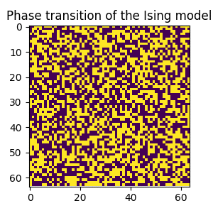

This repository contains code shows simple examples of Monte Carlo simulations.
There is an example jupyter notebook in this repository.

One example shown here is the phase transition of the 2D Ising model, which 
looks like this:

